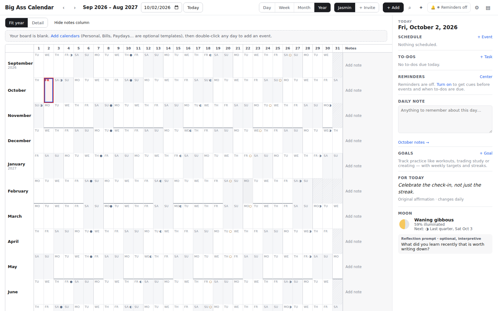

# Big Ass Calendar

A personal planning web app built around a giant **row-and-column year board**: twelve month rows, day columns 1–31, a weekday label in every valid cell, moon markers, and a notes column. It works like the handmade tri-fold board, with a daily dashboard alongside, Day/Week/Month views, reminders, goals and a reviewable planning assistant.



New accounts start completely blank: no calendars, events, to-dos, notes, goals or history. Calendar templates (Personal, Bills, Paydays, Trading, Workouts, Creating) are optional one-click additions and create **empty** calendars.

See **[STATUS.md](STATUS.md)** for the requirements checklist (implemented / partial / blocked).

## Stack

| Part | Choice | License |
| --- | --- | --- |
| UI | React 19 + TypeScript, Vite; custom accessible CSS-grid year board and time grid | MIT |
| Server | Node 22 + Express 5, run with `tsx` | MIT |
| Database | SQLite through Node's built-in `node:sqlite` (WAL), SQL migrations in `server/migrations` | Public domain |
| Dates & zones | Luxon (IANA zones, DST-aware) + small date-only helpers | MIT |
| Recurrence | Own RRULE subset (`shared/recurrence.ts`), expanded on local dates | — |
| Moon | astronomy-engine | MIT |
| Push | web-push (VAPID) | MPL-2.0 |
| Validation | zod | MIT |
| Assistant (optional) | `@anthropic-ai/sdk`, server-side only | MIT |

`shared/` holds code used by both the server and the browser: dates, recurrence, recurring-edit logic, the notification planner, streak rules, moon calculations, schemas.

## Local setup

Requirements: Node.js **22.13+** (for `node:sqlite`).

```bash
npm install
cp .env.example .env        # then edit as needed
npm run dev                 # API on :8787, web on http://localhost:5173
```

On first run `ALLOW_OPEN_SIGNUP=true` lets you create your own account. **Set it to `false` once you've signed up.** After that, accounts can only be created through an invitation link.

Production-style run on one port:

```bash
npm run build
npm start                   # serves dist/ and the API on PORT (default 8787)
```

Other scripts: `npm test` (Vitest), `npm run typecheck`, `npm run migrate`, `npm run vapid`.

The database file defaults to `./data/bigasscalendar.db` and is git-ignored. Migrations run automatically on start.

## Inviting Tehron (Together view)

1. Settings → Account & sharing → **Create invitation link**. The app never sends anything; you share the link yourself. Links work once and expire after 7 days.
2. Tehron opens the link and creates **his own** account and password on his own device. No credentials are created for him.
3. Each of you sets the sharing level for each of your own calendars: **Private** (default), **Free/busy only**, **See details**, or **Can edit**. The server enforces this on every request.
4. Header → **Together** shows both schedules side by side, with dates and times lined up and scrolling synced. **Overlay** shows them in one view, with person initials on each item. Timed events are shown in the viewer's time zone.

Notes, to-dos, goals and reminders are never shared, and a partner's events never trigger your reminders.

## Reminders & notifications: how delivery works

- **Planning.** After any change to an event, to-do or preference, the server works out which reminder jobs should exist for the next 8 days (`shared/notifyPlan.ts`). It then reconciles them with the `notification_jobs` table, keyed by a dedupe key: missing jobs are inserted and pending jobs that are no longer wanted are cancelled. Every 10 minutes it re-plans for all users so the 8-day window keeps moving forward. Moving, deleting, completing, reopening or changing a recurring item updates or cancels its jobs.
- **Delivery.** A scheduler in the server process checks every 15 s for due jobs:
  - Each due job creates exactly one in-app notification (unique per job) and one push delivery per target device.
  - A job that is past its expiry is marked *expired* and not delivered, so a late scheduler never sends a pile of stale alerts.
  - Push failures caused by network errors, 429 or 5xx are retried with backoff, up to 3 attempts.
  - A 404 or 410 response deletes that subscription, because the device revoked it or it went stale.
- **Durability.** Jobs live in SQLite, so a restart picks up where it stopped. Delivery does not depend on any page being open, but it does need the **server process to be running**. If you deploy to a platform that sleeps idle processes, use an always-on instance.
- **Quiet hours.** Reminders still reach the in-app center during quiet hours, but no push is sent.
- **Duplicates.** By default push goes only to the most recently enabled device. You can choose every device instead.
- **Privacy.** Lock-screen text hides titles unless you turn that on.
- **Status shown in the app.** The app shows one of these states: enabled, permission needed, blocked, unsupported, or server setup incomplete. Notification permission is requested only when you press "Turn on push here", never on first visit. A **Send test notification** button is included.

### Remaining setup for web push

1. `npm run vapid` → put the keys in `.env` as `VAPID_PUBLIC_KEY` / `VAPID_PRIVATE_KEY`, and set `VAPID_SUBJECT=mailto:you@…`. Restart.
2. Serve the app over **HTTPS**. Browsers allow push only on secure origins; `localhost` is the exception for development.
3. On **iPhone/iPad**, push works only after *Share → Add to Home Screen* (iOS 16.4+), and you must open the app from that icon.
4. On each device: bell → **Turn on push here** → **Send test notification**.

What has and hasn't been verified:

- **Verified in this repo:** job planning, reconciliation, expiry, quiet hours, retries and removal of revoked subscriptions, using a stubbed push sender in automated tests.
- **Not verified:** real delivery to a phone or a closed browser. That depends on your devices and their OS/browser settings (Focus/Do Not Disturb, browser notification permission, battery saver), and was not tested here.
- A notification that was queued or sent does not prove it appeared on the device. Without push, the in-app center still works while the app is open.

## Planning assistant & plan import

- **Plans.** A plan is JSON with `version: 1` and a list of typed operations. The operations can create, move, resize or delete events (with recurrence scope), set alerts, create to-dos, complete to-dos or change their due dates. See the schema in `shared/schemas.ts`.
- **Review before anything changes.** Every plan is validated, permission-checked and previewed with conflicts and destination calendars. **Nothing changes until Apply.**
- **Undo.** An applied plan can be undone. Records you edited after applying are left alone and reported.
- **Import.** *Import JSON plan* works with no configuration, so you can draft a plan in any chat tool and paste it in.
- **In-app assistant.** *Describe a plan* uses Claude through the server if `ANTHROPIC_API_KEY` is set. The key is never sent to the browser. The assistant only proposes a plan, which then goes through the same preview and Apply flow. It uses `claude-opus-5-5` by default with the server-side refusal fallback enabled (beta `server-side-fallback-2026-07-01`, `fallbacks: "default"`). `ANTHROPIC_MODEL` overrides the model.
- The app's chat is separate from any outside chat (for example ChatGPT); messages there do not reach the app.

## Dates, time zones and recurrence

- **All-day items and to-do due dates** are stored as plain `YYYY-MM-DD` dates and never shift between time zones.
- **Timed events** store a local wall-clock start and end plus an IANA zone. They are converted to UTC instants only for reminders and for showing an event in another person's zone.
- **Recurrence** is expanded on local dates, so a 9:00 weekly event stays at 9:00 across DST changes.
  - Times that don't exist (in the spring-forward gap) move forward, for example 02:30 → 03:30.
  - Times that happen twice (at fall-back) use the first occurrence.
  - Monthly rules on the 29th–31st skip months that don't have that day. A yearly Feb 29 occurs only in leap years.
- **Editing a recurring event** asks you to choose *this occurrence*, *this and following*, or *all*:
  - *This occurrence* stores an exception.
  - *This and following* splits the series. Counted series keep their total number of occurrences.
  - Moving the whole series shifts its weekdays and keeps any exceptions.

## Tests

`npm test` runs 49 tests:

- `tests/dates.test.ts`: board range, weekdays, leap years, DST gap/overlap, local "today".
- `tests/recurrence.test.ts`: expansion rules and this / following / all edits with exceptions.
- `tests/moon-streaks.test.ts`: moon quarter instants checked against USNO reference times (±3 min), streak rules, stable daily affirmation.
- `tests/server.test.ts`: in-memory database, never your real data file. Covers:
  - blank accounts, invitation-only signup and CSRF header
  - private / free-busy / details / edit enforcement, notes never shared, stale-version rejection
  - reminder scheduling, rescheduling and cancellation; recurring occurrences
  - task complete/reopen; idempotent check-ins
  - delivery dedupe, expiry, quiet hours, bounded retries, revoked endpoints
  - plan preview / apply / undo, malformed plans, and plans unable to bypass permissions

## Keyboard

- **Shortcuts:** `T` today · `D`/`W`/`M`/`Y` views · `N` new event · `/` search · `Ctrl/⌘+Z` undo.
- **Year board:** arrow keys move between days, `Enter` creates an event.
- **Events:** `Enter` opens the focused event, `Alt+←/→` moves it a day, and in Day/Week view `Alt+↑/↓` moves it 15 minutes.
